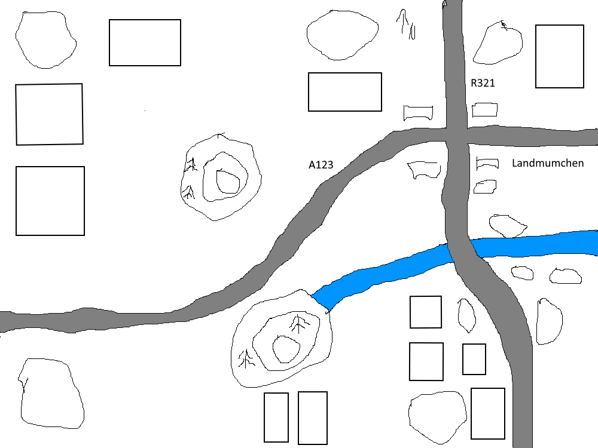

The day of reckoning had arrived at last for the US armoured company waiting on the wide open plains of West Germany at Landmunchen. Arrayed against them were the elite of the Soviet Army. The US personnel knew that the Soviets would soon be hurtling straight towards them.

The Soviets had to reach the west part of the map by the end of the day. The USA simply had to stop them. The weather was fowl, meaning there'd be no little friends for the Americans. The Soviets knew it and intended to take full advantage.

The Americans did have one thing on their side. They'd managed to lay four very extensive minefields at strategic choke points. In their haste to take advantage of the weather, the Soviets had neglected to bring up any specialist anti-mine equipment. This would play a crucial part in the battle.

The Soviet storm started with three long columns of T-64 tanks heading towards the Americans. One heading through Landmunchen supported by an armoured rifle platoon, another two to the far south. Things went wrong for the Soviets from the start.

The exposed armoured column heading towards Landmunchen met stiff resistance and found itself being mown down by the entrenched US infantry in the town.

The armoured columns to the south quickly got bogged down attempting to cross the difficult ground it was forced into by the minefields. All the time, the Soviet tanks were being sniped at long distance by Abrams tanks and ITVs.

The Soviets were to be disappointed with their gains. The officer in charge quickly scribbled a goodbye letter to his wife in Moscow fearing the worse. He was right to be concerned.

## Landmunchen Photos









## Credit

Photos and report written by Jack Hughes and published on the Leeds Night Owls website with permission.
