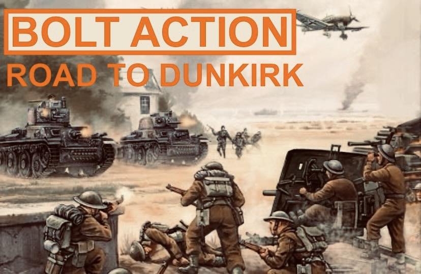

# Road to Dunkirk Bolt Action Campaign

Leeds Night Owls is hosting a *Fall of France* campaign set during 1940, an enjoyable series of non-competitive games for all participants. The campaign will use the Bolt Action rules.

## Upcoming Events

    

        
    

    

        <h3><a href="/events/road-to-dunkirk-part-deux/" class="text-decoration-none">Road to Dunkirk Part Deux</a></h3>
        
11 April 2026

        
The second event in the Night Owls Fall of France campaign is a British counter-attack at Arras.

        <a href="/events/road-to-dunkirk-part-deux/" class="btn btn-outline-secondary btn-sm">View event</a>
    

## Past Events

No past events recorded.

