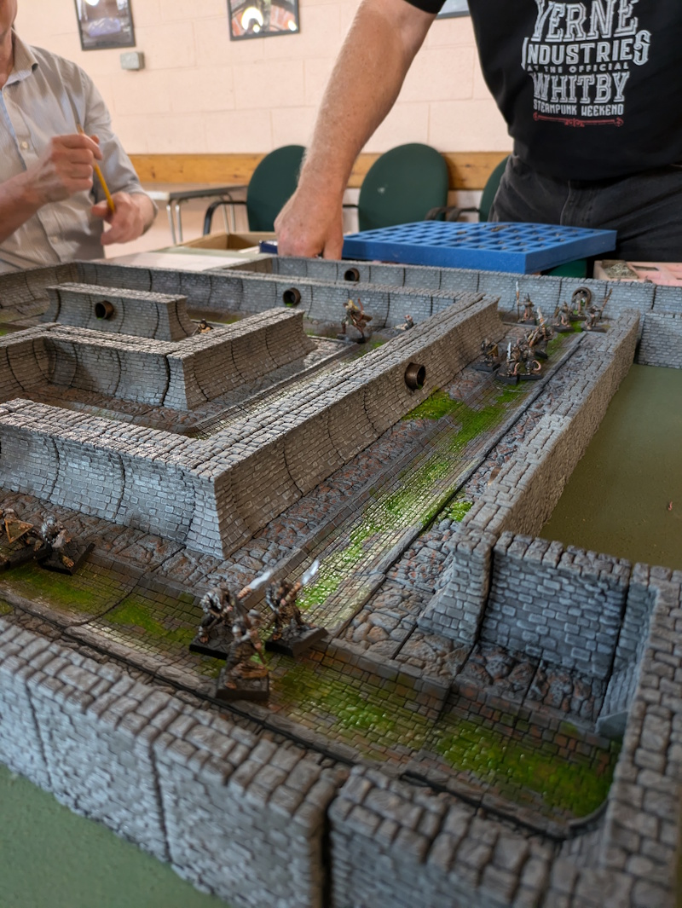

Alan has been running a bespoke dungeon crawling RPG for some time now. Each episode typically attracts a number of intrepid adverturers ready to enter the dark and dank depths of Alan's imagination.

Alan takes the role of dungeon master with the rest of us hardy fellows serving as wandering adventurers in search of loot and err, tea.

<figure>
    
    <figcaption>Alan's Dungeon Crawl under way with a horde of deeply unpleasant creatures coming out of the stonework.</figcaption>
</figure>

The campaign is co-ordinated by Alan using the Leeds Night Owls Facebook page.
